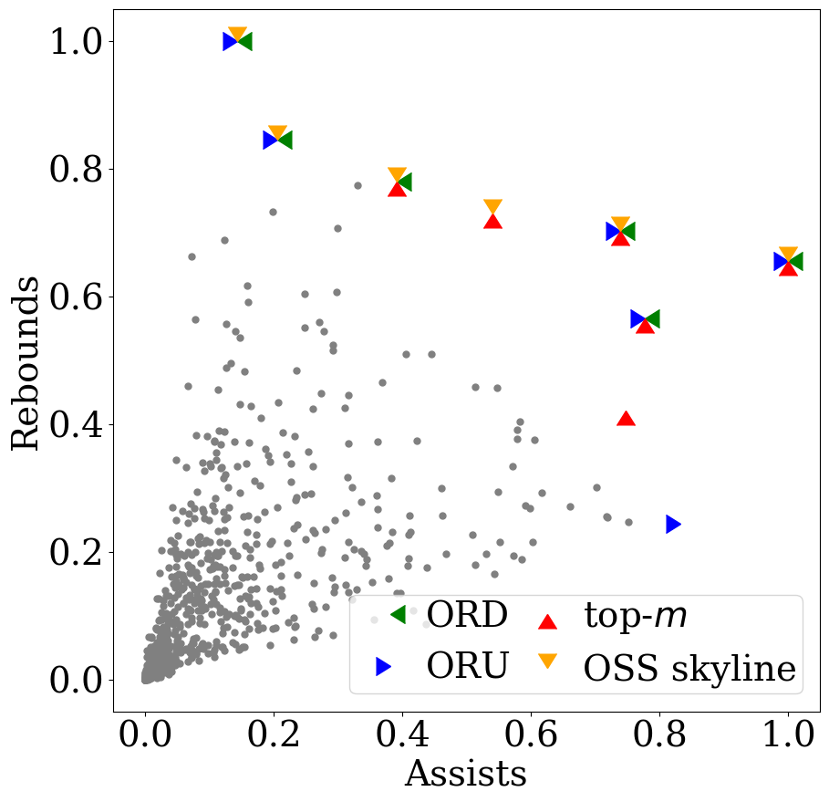
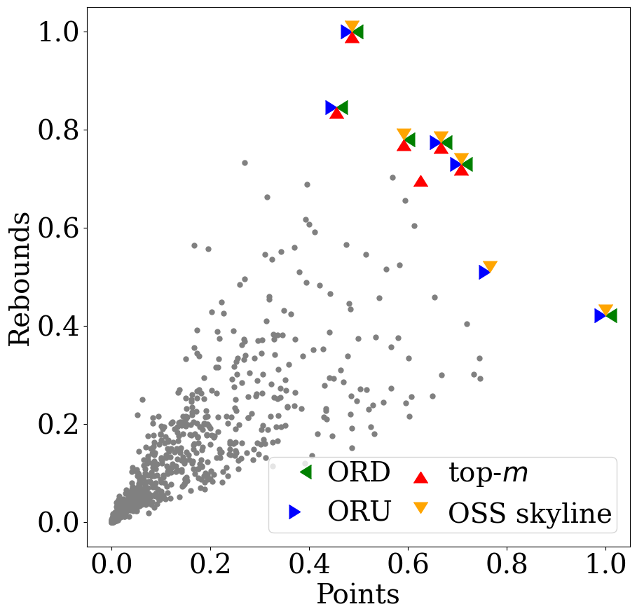

# ORDU

This is a cmake project (a complete C Plus Plus project) for paper:\
Kyriakos Mouratidis, Keming Li, and Bo Tang. 2021. Marrying Top-k with Skyline Queries: Relaxing the Preference Input while Producing Output of Controllable Size. In Proceedings of the 2021 International Conference on Management of Data (SIGMOD/PODS '21). Association for Computing Machinery, New York, NY, USA, 1317-1330. DOI:https://doi.org/10.1145/3448016.3457299 

WE HAVE UPLOAD THE BASIC NON-ORDER SENSITIVE ORU OPERATOR.
Currently I am working on sorting out dataset
The code of this project is cleaning

Before running this code:

Step1:
download make and cmake

Step2:
download source code of Qhull, compile it using cmake and install it:http://www.qhull.org/download/

Step3:
modify the paths in CMakeLists.txt if your path of Qhull is different from us

To install qhull
-----------------
Installing Qhull with CMake 2.6 or later

  See CMakeLists.txt for examples and further build instructions

  To build Qhull, static libraries, shared library, and C++ interface
  ```
  git clone https://github.com/qhull/qhull.git
  cd qhull/build
  cmake --help  # List build generators, the system will tell you the next step which generator you should use 
  cmake -G "<generator>" ..   # e.g., "cmake -G "Unix Makefiles" .." 
  cmake --build .
  sudo cmake --build . --target install # check /usr/local/lib contains libqhull relavent lib and whether /usr/local/include contains libqhull relavent hearders.
  ```

  The ".." is important.  It refers to the parent directory (i.e., qhull/)

  On Windows, CMake installs to C:/Program Files/qhull.  64-bit generators
  have a "Win64" tag.  Qhull's data structures are substantial larger as
  64-bit code than as 32-bit code.  This may slow down Qhull.

  If creating a qhull package, please include a pkg-config file based on build/qhull*.pc.in

  If cmake fails with "No CMAKE_C_COMPILER could be found"
  - cmake was not able to find the build environment specified by -G "..."

-----------------

To install osqp
-----------------
  ```
  git clone --recursive https://github.com/oxfordcontrol/osqp
  cd osqp
  mkdir build
  cd build
  cmake --help  # List build generators, the system will tell you the next step which generator you should use 
  cmake -G "<generator>" ..   # e.g., "cmake -G "Unix Makefiles" .." 
  cmake --build .
  sudo cmake --build . --target install  # check /usr/local/lib contains libosqp relavent lib and whether /usr/local/include contains libosqp relavent hearders.
  ```
-----------------


To compile this project, ORDU
-----------------
  ```
  git clone https://github.com/ghlkm/ordu.git
  cd ordu # go to the directory of ORDU
  mkdir build
  cd build
  cmake --help  # List build generators, the system will tell you the next step which generator you should use 
  cmake -G "<generator>" ..   # e.g., "cmake -G "Unix Makefiles" .." 
  cmake --build .  # it may should a lot of warnings because I set "-Wall" in CMakelists.txt
  ```
-----------------
  
This is an example to run 
-----------------

the source code for the bounded size top-k query (ORD, ORU) problem.

to run (I assume you are in the build directory of ordu you created in the last step):
```
./iPref -w 10 -k 10 -d 4 -m 50 -f ../data/pdt4d400k.txt -mt ORU_OA3 -W ../data/user4d200k.txt -n 2000000 -i ./idx.txt
``` 
Explaination for the running parameters for iPref,

 - "-w", how many users preferences you want to test in "-W" user preferences file. In our example, it only takes the first 10 users (the first 10 rows in file)
 - "-k", the "k" meantioned in paper Marrying Top-k with Skyline Queries: Relaxing the Preference Input while Producing Output of Controllable Size, https://dl.acm.org/doi/10.1145/3448016.3457299
 - "-d", the problem dimensions, this should be consistency with product file and user file
 - "-m", the "m" meantioned in paper
 - "-f", where to find the input product file, this example show a independent distributed product file in 4d case. Each row of this file follows the format "id p_l1 p_l2 p_l3 p_l4 p_u1 p_u2 p_u3 p_u4". Take a laptop product as an example, if there is a laptop in 
CPU speed, GPU speed, screen quanlity, and price have 0.1, 0.2, 0.3, and 0.4 scores respectly, then this laptop may be listed in this product file as "1 0.0999 0.1999 0.2999 0.3999 0.1001 0.2001 0.3001 0.4001". You could see that the first attribute "0.1" is splited into 0.0999 and 0.1001.
 - "mt", which method to use. This parameter is used in main.cpp to decide which method to use. \
 "ORD_GN" is another version baseline of ORD that support fetch product one by one.\
"ORD_OA_GN" is another advance version of ORD that support fetch product one by one.\
"ORU_BB" is the ORU baseline.\
"ORU_OA" is the ORU advance.\
"ORU_OA3" is the newest ORU advance.\
"CS", "CS2", and "CS3" are the case study running instances.\
Especially, "CS" is used to reproduce the case study in our paper.\
"ORU_NO", a non-order-sensitive baseline of ORU.
  
- "-W", the input user preference file, each row present a user, and the sum of a row is 1.
- "-n", only fetch first n row of product file. In our example we set it larger than the row numbers of "../data/pdt4d400k.txt", our project will automatically load the whold product file.
- "-i", the rtree index file. In some system setting, our project would run fail because it cann't create this file. I recommention you can manually create this file as empty so that rtree can use this file to store some temporaty results.


-----------------
Case Study
-----------------
if you are interested in reproduce the case study results we made in the paper, 
you can refer to directory /caseStudy_reproduce \
 

-----------------

--------------
Dataset
--------------
The dataset can be found the the "real" folder of 
https://drive.google.com/drive/folders/1TaUDTRGgEVmkSvdTbDbYQb5LH0r6gNdm


There might be some different from what paper describe, such as independent data size is 500K rather than 400K memtioned in the paper, you can just use 400K of them. 
  
------------
You could also find the copy of this project in https://github.com/DBGroup-SUSTech/ordu   \
If you got any problem to run this project, please contact likm2020@mail.sustech.edu.cn   \
If you are using the code of this project, please cite our paper: \
  @inproceedings{10.1145/3448016.3457299,\
author = {Mouratidis, Kyriakos and Li, Keming and Tang, Bo}, \
title = {Marrying Top-k with Skyline Queries: Relaxing the Preference Input While Producing Output of Controllable Size},\
year = {2021},\
isbn = {9781450383431},\
publisher = {Association for Computing Machinery},\
doi = {10.1145/3448016.3457299},\
booktitle = {Proceedings of the 2021 International Conference on Management of Data},\
pages = {1317–1330},\
numpages = {14},\
series = {SIGMOD/PODS '21}\
}
  

