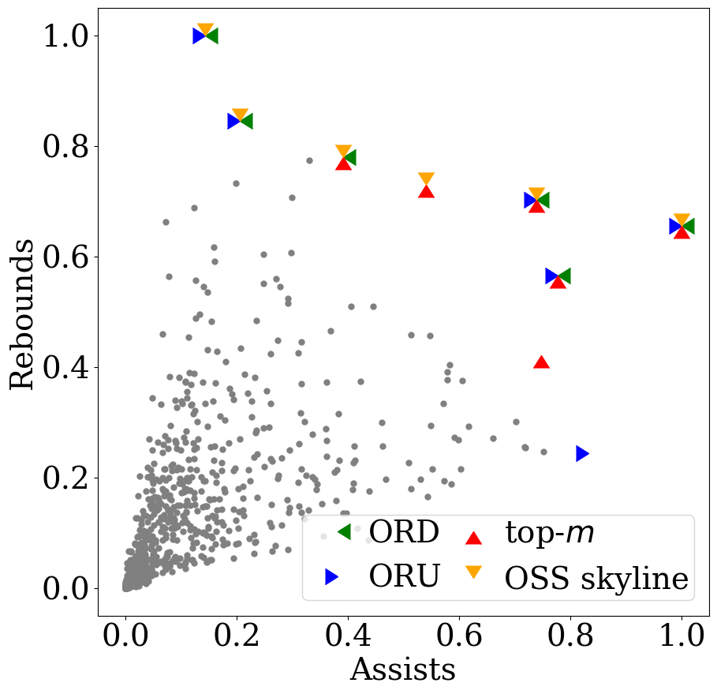
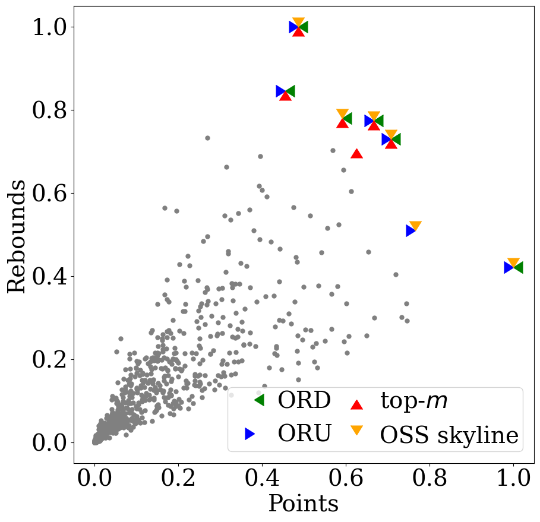

 

step1 run case study 
---------
Go to directory /build and run case study as follow command.
```
./iPref -w 1 -k 2 -d 2 -m 6 -f ../data/ast_trb.dat -mt CS -W ../data/user_ast_trb.txt  -n 30000000 -i ../idx/idx1.txt 
```

This case study set 1 input user (-w 1) in user file user_ast_trb.txt,\
k=2, m=6, and a 2d NBA player file (assist and rebounds data).
After execute command as shown above, you will get a file called "result.txt".

--------
step2 run python3 script to draw result 
--------
if your computer don't have python3, you can go to https://www.anaconda.com/products/individual
download anaconda with python3.
After download anaconda you will get python3 and a python package manager pip.
Open anaconda prompt and install package numpy and matplotlib as:
```
pip install numpy # sometimes it may be "pip3 install numpy"
pip install matplotlib # sometime it may be "pip3 install matplotlib" 
``` 
  
go to directory /caseStudy_reproduce and run python as follows:
```
python draw.py ../data/ast_trb.dat ./result.txt # sometimes it may be "python3 draw.py ../data/ast_trb.dat ./result.txt"
``` 

You will get the same figure as our paper's Figure 6(a) except players names and correct axis labels.

---------------
To reproduce the case study Figure 6(b), you just need to execute the some command as shown above except
replacing "ast_trb.dat" with "trb_pts.dat", and replacing "user_ast_trb.txt" with "user_trb_pts.txt"

---------------
If you want to change the label of generated figure or save figure, 
you can modify it in draw.py easily.  

--------------
If you got any problem to run this project, please contact likm2020@mail.sustech.edu.cn   \
If you are using the code of this project, please cite our paper: \
  @inproceedings{10.1145/3448016.3457299,\
author = {Mouratidis, Kyriakos and Li, Keming and Tang, Bo}, \
title = {Marrying Top-k with Skyline Queries: Relaxing the Preference Input While Producing Output of Controllable Size},\
year = {2021},\
isbn = {9781450383431},\
publisher = {Association for Computing Machinery},\
doi = {10.1145/3448016.3457299},\
booktitle = {Proceedings of the 2021 International Conference on Management of Data},\
pages = {1317–1330},\
numpages = {14},\
series = {SIGMOD/PODS '21}\
}

